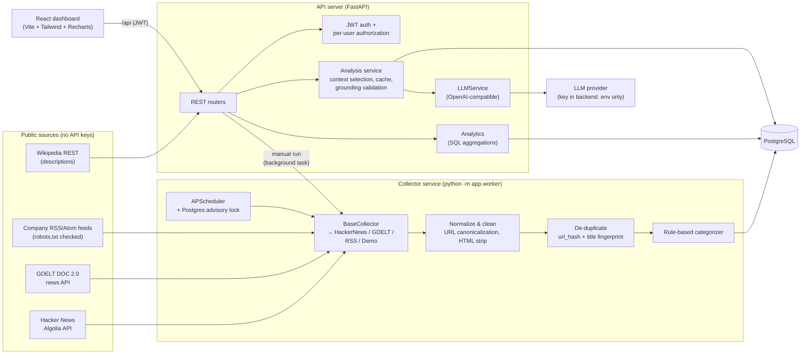
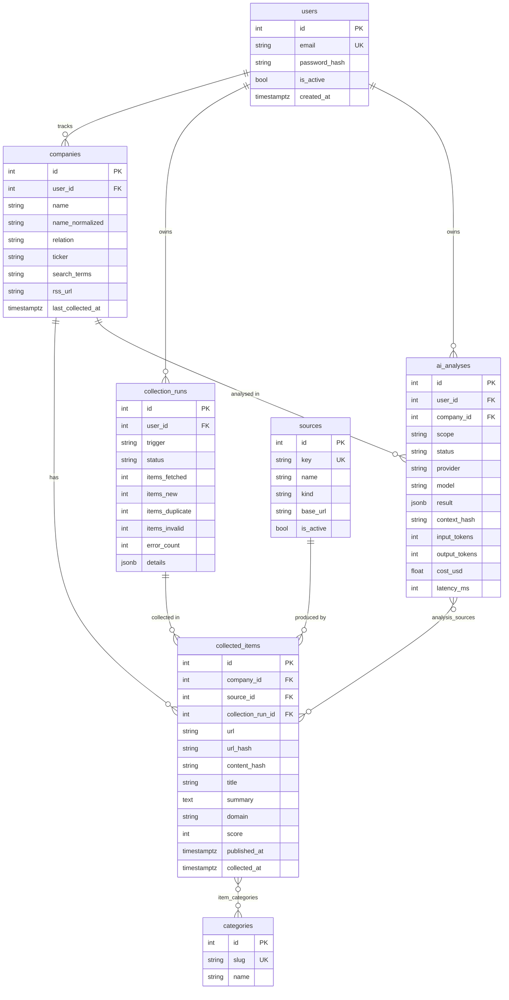

# Market Intelligence Platform

A full-stack web app for monitoring companies and competitors. It collects public news and discussion
automatically on a schedule, cleans and de-duplicates it into PostgreSQL, runs analytics over it, and
produces AI market analyses in which **every insight cites the collected source it came from**.

Built as a portfolio project to demonstrate full-stack development (FastAPI + React), data automation
(a modular collector pipeline with scheduling and failure isolation), and responsible LLM integration
(grounding, token budgets, caching, and usage tracking).

---

## Contents
- [Features](#features)
- [Architecture](#architecture)
- [Tech stack](#tech-stack)
- [Database schema](#database-schema)
- [Data collection pipeline](#data-collection-pipeline)
- [AI analysis pipeline](#ai-analysis-pipeline)
- [API endpoints](#api-endpoints)
- [Authentication & security](#authentication--security)
- [Token / cost management](#token--cost-management)
- [Running with Docker](#running-with-docker)
- [Running locally without Docker](#running-locally-without-docker)
- [Testing](#testing)
- [Project structure](#project-structure)
- [Limitations](#limitations)
- [Future improvements](#future-improvements)

---

## Features

| Area | What it does |
|---|---|
| **Dashboard** | KPI cards, market activity over time, activity by category, data points per company, most-mentioned companies, trending terms (this period vs previous), competitor activity, recent items, latest AI insights. Loading, empty, and error states throughout. |
| **Company tracking** | Add / list / remove companies with a relationship (*our company / competitor / watching*), optional ticker, industry, custom search terms and an RSS feed. Descriptions are auto-filled from Wikipedia when left blank. The detail page shows stats, a 30-day timeline, categories, recent items and an AI summary. |
| **Automated collection** | Scheduled collector (APScheduler) plus a **Run collection now** button. Fetch, parse, clean, de-duplicate, store, and record each run with per-source stats and errors. |
| **AI market analysis** | Market-wide or per-company analysis: summary, emerging trends, important developments, competitor activity, opportunities, risks, and key takeaways. Each insight has clickable citations, and the sources list is shown beside it. |
| **Search** | Server-side filtering by company, keyword (all words must match), category, source and date range, with sorting and pagination. |
| **Automation page** | Run history with fetched/new/duplicate/invalid counts, duration, per-source breakdown and error messages. |
| **AI usage** | Number of analyses, input/output tokens, approximate cost, average latency, tokens per day, and recent calls. |

---

## Architecture



**Separation of concerns**

- **API server** (`backend` container): REST API only. In Docker its in-process scheduler is disabled.
- **Data collection service** (`collector` container): the same codebase started with `python -m app.worker`, running the scheduler.
  Manual runs triggered from the UI execute in the API process as a background task. Both paths use the same `collection_service`.
- **Database**: PostgreSQL 16.
- **AI service**: `LLMService` is an abstract class. `OpenAICompatibleLLM` is the only class that talks to a model. Swapping providers is a config change.
- A **Postgres advisory lock** ensures that only one scheduler executes a scheduled collection at a time, even if several processes have a scheduler enabled.

---

## Tech stack

| Layer | Technology |
|---|---|
| Frontend | React 18, Vite 6, TypeScript (strict), Tailwind CSS v4, Recharts, React Router, lucide-react |
| Backend | Python 3.11, FastAPI, Pydantic v2, SQLAlchemy 2.0, psycopg 3 |
| Database | PostgreSQL 16 |
| Collection | httpx (timeouts and retries), BeautifulSoup + lxml (RSS/Atom and HTML cleaning), urllib.robotparser, APScheduler |
| AI | Any OpenAI-compatible Chat Completions API via `LLMService` |
| Auth | bcrypt password hashing, PyJWT (HS256) |
| Infrastructure | Docker, Docker Compose, nginx (serves the SPA and proxies `/api`) |
| Tests | pytest against a real PostgreSQL, with httpx `MockTransport` for external HTTP |

---

## Database schema



Key constraints and indexes:

- `UNIQUE(companies.user_id, name_normalized)`: a user can't track the same company twice (case- and space-insensitive). Different users can.
- `UNIQUE(collected_items.company_id, url_hash)` and `UNIQUE(company_id, content_hash)`: database-level duplicate protection.
- `CHECK` constraints on `relation`, run `status`/`trigger`, and analysis `scope`/`status`.
- Indexes on `(company_id, published_at)`, `published_at`, `domain`, `source_id`, `item_categories.category_id`, and `(user_id, company_id, created_at)` on analyses.
- Foreign keys cascade: removing a company removes its items and analyses. Sources use `RESTRICT`.
- `sources` and `categories` are reference tables, seeded idempotently on startup.

> Items are stored **per tracked company**, so tenants are fully isolated. If two users track the same company, its items are stored twice. This trades storage for simple, safe authorization.

---

## Data collection pipeline

```
fetch (collector) → parse → normalize/clean → validate → de-duplicate → categorize → store → record run
```

1. **Fetch.** Each collector subclasses `BaseCollector` and implements `fetch(company) -> list[RawItem]`:
   - `HackerNewsCollector`: HN Algolia search API, last *N* days, keeping only stories whose title or text actually mentions the term.
   - `GdeltNewsCollector`: GDELT DOC 2.0 article list. Throttled process-wide (GDELT asks for ≤1 request per 5 s). Has a long timeout because queries take 15–25 s, plus a 2-minute cooldown after a 429.
   - `RssFeedCollector`: a company's own feed. **robots.txt is checked first**, and HTML pages masquerading as feeds are rejected.
   - `DemoCollector`: only when `COLLECTOR_DEMO_MODE=true`. Serves a bundled dataset about **fictional** companies (Acme Robotics, Globex Cloud, Initech AI), clearly labelled *Demo Dataset (sample, not live)*.
2. **Reliability** (in `BaseCollector._request`): timeouts, retries with backoff on network errors and 5xx, `Retry-After`-aware handling of 429, and no retries on other 4xx. Responses are validated (non-JSON or unexpected shape raises `InvalidResponseError`).
3. **Normalize** (`services/normalization.py`): canonicalize URLs (scheme, `www.`, tracking params such as `utm_*`/`fbclid`, fragments, trailing slashes), unescape and strip HTML, NFKC-normalize, collapse whitespace, truncate, clamp future dates, and reject items without a valid http(s) URL or title.
4. **De-duplicate**: `url_hash` (canonical URL) **and** `content_hash` (title fingerprint with the trailing "– Publisher" removed), so the same story syndicated at different URLs is stored once. Checks run against the DB and within the batch, and every insert is wrapped in a savepoint so concurrent inserts are counted as duplicates instead of failing.
5. **Categorize** with transparent keyword rules (`services/categorizer.py`, whole-word and prefix matching, no tokens spent).
6. **Record**: every run is a `collection_runs` row: `running` → `success` / `partial` / `failed`, with counts, per-source stats, error messages and skipped fetches.

**Failure isolation.** Failures are caught per *(company, collector)*. One failing source never aborts the run, and unexpected exceptions are logged and reported generically without leaking internals. A provider that rate-limits is skipped for the rest of the run (circuit breaker). Runs stuck in `running` for over 30 minutes (for example, after a worker crash) are marked failed. Only one run per user can be active at a time (HTTP 409).

**Adding a source** takes one subclass and one line in `collectors/registry.py`:

```python
class MyCollector(BaseCollector):
    key, name, kind, base_url = "mysource", "My Source", "api", "https://api.example.com"
    def fetch(self, company: CompanyQuery) -> list[RawItem]:
        data = self._get_json(self.base_url, params={"q": company.name})  # retries/timeouts built in
        return [RawItem(url=d["url"], title=d["title"], published_at=...) for d in data["results"]]
```

### How automation works
- `collector` container: `python -m app.worker` waits for the DB, creates the schema, and starts APScheduler with an interval job (`COLLECTION_INTERVAL_MINUTES`, default 60, first run 15 s after start).
- Each tick takes a **Postgres advisory lock** and then runs a collection for every active user who tracks at least one company.
- The UI's **Run collection now** calls `POST /collection/run`, which returns `202` with the run, executes in the background, and is polled by the UI until finished.
- Outside Docker, `SCHEDULER_ENABLED=true` runs the same scheduler inside the API process for convenience.

---

## AI analysis pipeline

```
select relevant items → de-dup near-identical stories → cap context → cache check → LLM (JSON) → grounding validation → store
```

1. **Context selection**: only the requesting user's items, within the chosen window (7/30/90 days), for one company or interleaved across companies (market scope), newest first.
2. **Avoid duplicate information**: headlines about the same event are collapsed before prompting. This uses an overlap coefficient on lightly stemmed title words, ignoring the company's own name; across companies the full title must match closely, so "A raises Series C" and "B raises Series C" remain separate.
3. **Budget**: at most `LLM_MAX_CONTEXT_ITEMS` (25) items and `LLM_MAX_CONTEXT_CHARS` (12k) characters. Each item is sent as a compact numbered line (`[n] date | company | domain | categories` + title + ≤280-char summary).
4. **Cache**: a hash of *(prompt version, scope, company, provider, model, exact item ids)*. If an identical analysis succeeded within `ANALYSIS_CACHE_MINUTES`, it is returned with `cached: true` and costs zero tokens. **Force refresh** bypasses the cache.
5. **Prompt**: the system prompt forbids outside knowledge and requires every insight to cite source numbers, an empty list when evidence is missing, length limits, and JSON-only output (`response_format: json_object`, with automatic fallback for servers that don't support it). `max_tokens` is capped by `LLM_MAX_OUTPUT_TOKENS`.
6. **Grounding validation** (`parse_and_validate`): any insight with **no citations or citations to non-existent sources is discarded**, invalid `[n]` references are removed from the summary, and the number of dropped insights is stored.
7. **Persist**: `ai_analyses` stores the result, the ordered source mapping, tokens, cost, latency and model, and `analysis_sources` links the items. Failed calls are stored too, with the error message, so they show up in usage stats.
8. **Display**: the UI shows each insight with clickable citation chips that scroll to the numbered sources list (title, company, source, date, and a link to the original).

**LLM failures** (timeout, 401/403 key rejected, 429 rate limit with `Retry-After`-aware retries, 5xx, invalid JSON) become clear user-facing messages (`429`/`502`/`503`/`504`). Provider response bodies and keys are never echoed.

**No API key?** The default `LLM_PROVIDER=extractive` mode makes **no LLM call**. It builds a rule-based digest that groups and quotes source headlines by category, with the same citation format, and is labelled *"Extractive (no LLM)"* in the UI. It never presents itself as AI-generated prose. Set `LLM_PROVIDER=openai` and `LLM_API_KEY` to use a real model.

---

## API endpoints

Interactive docs are at `http://localhost:8000/docs` (disabled when `ENVIRONMENT=production`).
All endpoints except register, login and health require `Authorization: Bearer <token>`.

| Method | Path | Description |
|---|---|---|
| POST | `/auth/register` | Create account → JWT (409 if the email exists) |
| POST | `/auth/login` | Log in → JWT (401 generic message; rate limited) |
| GET | `/auth/me` | Current user |
| GET | `/companies` | Tracked companies with item counts |
| POST | `/companies` | Track a company (409 on duplicate, 422 on invalid input) |
| GET | `/companies/{id}` | Detail: stats, timeline, categories, recent items, latest analysis |
| DELETE | `/companies/{id}` | Stop tracking (cascades items and analyses) |
| GET | `/items` | Search: `company_id, q, category, source, date_from, date_to, sort, page, page_size` |
| GET | `/items/{id}` | One item |
| GET | `/categories`, `/sources` | Filter options |
| POST | `/collection/run` | Start a manual collection (202; 409 if one is running) |
| GET | `/collection/runs`, `/collection/runs/{id}` | Run history / detail |
| GET | `/collection/status` | Scheduler config, active collectors, next run |
| POST | `/analysis/company/{id}` | Analyze one company `{days, force}` |
| GET | `/analysis/company/{id}` | Analysis history for a company |
| POST | `/analysis/market` | Analyze all tracked companies |
| GET | `/analysis/market` | Market analysis history |
| GET | `/analysis/{id}` | One analysis with sources |
| GET | `/analytics/dashboard?days=` | All dashboard aggregates in one call |
| GET | `/usage/ai` | Token, cost and latency summary |
| GET | `/health` | Liveness + DB check |

Errors are always JSON: `{"detail": "..."}`. Validation errors also include `errors: [{field, message}]`, and unexpected server errors return only `{"detail": "Internal server error", "error_id": "..."}` (the stack trace is logged server-side, never returned).

---

## Authentication & security

- Passwords are hashed with **bcrypt** (cost 12) and must contain at least 8 characters, a letter and a digit. Login timing is equalized and errors are generic (no account enumeration).
- **JWT** (HS256) carries `sub`, `exp`, `iat` and `type`. Expiry, signature and type are all validated, and the user must still exist and be active.
- **Authorization**: every query is scoped by `user_id`. Another user's company, item, analysis or run returns **404** (not 403), so existence isn't leaked. Tests cover this.
- **Secrets** (`JWT_SECRET`, `LLM_API_KEY`) live only in the backend environment. The frontend calls the backend through `/api` and never sees a key. Compose refuses to start without `JWT_SECRET`.
- **SQL injection**: SQLAlchemy only, parameterized everywhere. `LIKE` wildcards in search input are escaped.
- **Input validation** with Pydantic: lengths, URL types, enum-like literals, a ticker regex, and bounded pagination and date ranges.
- **Rate limiting** (in-memory, per process): login 10/min/IP, register 5/min/IP, analysis 10/min/user, manual collection 3/min/user.
- Collectors respect `robots.txt` (RSS), throttle per provider guidance (GDELT), send an identifying User-Agent, and never bypass CAPTCHAs, authentication or anti-bot measures.
- nginx adds `X-Content-Type-Options`, `X-Frame-Options` and `Referrer-Policy`, and CORS is restricted to configured origins.

---

## Token / cost management

| Technique | Where |
|---|---|
| Only the user's items in the requested window and scope are considered | `select_context` |
| Near-duplicate stories collapsed before prompting | `_overlap` dedup in `analysis_service.py` |
| Hard caps: 25 items / 12k chars of context, 280-char summaries | `LLM_MAX_CONTEXT_*` |
| Output capped (`max_tokens`), concise-insight instructions | `LLM_MAX_OUTPUT_TOKENS` |
| Identical requests served from the stored analysis | `context_hash` + `ANALYSIS_CACHE_MINUTES` |
| Categorization and trends computed without the LLM | rule-based categorizer, SQL analytics |
| Provider-reported `usage` stored; ~4 chars/token estimate (flagged `*`) when missing | `OpenAICompatibleLLM._parse` |
| Approximate cost = tokens × configured $/1M input/output | `LLM_*_COST_PER_MILLION` |

The **AI Usage** page shows the number of analyses (success/failed), input and output tokens, approximate cost, average response time, tokens per day, and recent calls.

---

## Running with Docker

```bash
cp .env.example .env
# edit .env: set JWT_SECRET (required) and POSTGRES_PASSWORD; optionally LLM_PROVIDER=openai + LLM_API_KEY
docker compose up --build
```

| Service | URL |
|---|---|
| Web app (nginx → React, `/api` → FastAPI) | http://localhost:8080 |
| API + Swagger docs | http://localhost:8000/docs |
| PostgreSQL | internal (`db:5432`) |

Containers: `db` (postgres:16-alpine with a persistent volume), `backend` (API), `collector` (scheduler worker), and `frontend` (nginx). Run the test suite in Docker against a dedicated `mip_test` database:

```bash
docker compose --profile test run --rm tests
```

Offline demo (no internet needed for collection): set `COLLECTOR_DEMO_MODE=true`, then track **Acme Robotics**, **Globex Cloud** and **Initech AI**.

---

## Running locally without Docker

Requirements: Python 3.11+, Node 20+, and a PostgreSQL database. If you don't have PostgreSQL, `pgserver` (a pip package) can run one for development.

```bash
# backend
cd backend
python -m venv .venv && .venv/Scripts/activate      # Windows; use .venv/bin/activate on macOS/Linux
pip install -r requirements-dev.txt
python scripts/dev_postgres.py          # optional: starts a local PostgreSQL and prints DATABASE_URL
cp ../.env.example .env                 # set DATABASE_URL and JWT_SECRET
uvicorn app.main:app --reload --port 8000

# frontend (second terminal)
cd frontend
npm install
npm run dev                              # http://localhost:5173 (proxies /api → :8000)
```

Optional: `python scripts/seed_demo_user.py` creates a local demo account.

---

## Testing

```bash
cd backend
pytest            # uses TEST_DATABASE_URL, or starts a throwaway PostgreSQL via pgserver
```

42 tests run against a **real PostgreSQL** database. External HTTP (news APIs, LLM) is mocked with `httpx.MockTransport`, so tests are deterministic and need no network or API key.

| File | Covers |
|---|---|
| `test_auth.py` | Register/login, bcrypt hashing, duplicate email, password rules, invalid/expired/forged JWT, login rate limit |
| `test_companies.py` | Create/list/detail/delete, cascade delete, duplicate names, per-user uniqueness, validation |
| `test_authorization.py` | **User B cannot read, delete or analyze user A's** companies, items, analyses, runs or dashboard data |
| `test_collection.py` | URL canonicalization, HTML cleaning, categorizer, duplicate detection (URL, title, in-batch), run recording, partial/failed runs, contained exceptions, concurrent-run guard, rate-limit circuit breaker, API-triggered run, collector parsing, timeouts, retries, invalid JSON, GDELT 429/cooldown, RSS parsing, robots.txt |
| `test_analysis.py` | Extractive analysis with sources, LLM path (token usage, cost, **ungrounded insights dropped**, invalid citations removed), caching and force refresh, LLM 429/401/invalid JSON handled and recorded, usage estimates, no-data 422, market scope, context cap and dedup, reworded headline dedup |
| `test_search_and_analytics.py` | Keyword/company/category/date filters, LIKE escaping, pagination bounds, dashboard aggregates, health |

---

## Project structure

```
backend/
  app/
    main.py                 FastAPI app, error handlers, CORS, lifespan (schema + optional scheduler)
    worker.py               Standalone collector service entry point
    scheduler.py            APScheduler job + Postgres advisory lock
    config.py  db.py  models.py  schemas.py  security.py  deps.py  rate_limit.py
    collectors/             base.py, hackernews.py, gdelt.py, rss.py, demo.py, registry.py
    services/               collection_service, normalization, categorizer, llm_service,
                            analysis_service, analytics_service, enrichment, bootstrap
    routers/                auth, companies, items, collection, analysis, analytics
    data/demo_items.json    Offline demo dataset (fictional companies)
  tests/                    pytest suite (real PostgreSQL)
  scripts/                  dev_postgres.py, seed_demo_user.py
  Dockerfile                multi-stage: runtime + test targets
frontend/
  src/pages/                Auth, Dashboard, Companies, CompanyDetail, Analysis, Data, Automation, Usage
  src/components/           Layout, ui primitives, charts, AnalysisView, ItemRow, RunCollectionButton
  src/lib/                  api client, auth context, hooks, types, formatting
  Dockerfile  nginx.conf
docker-compose.yml  .env.example  docker/postgres/init-test-db.sql
```

---

## Limitations

- **Source coverage.** HN and GDELT are free and keyless, but HN is tech-centric, and GDELT returns headlines only (no article text) from full-text matching, so some items only mention a company in passing. **GDELT rate-limits aggressively** per IP, so runs often finish as `partial` with GDELT skipped. This is handled and reported, but it means fewer GDELT items.
- **Keyword matching.** Matching is name/term based, so ambiguous names (e.g. "Apple", "Meta") pick up noise. Use the *search terms* field to narrow them.
- **Extractive mode isn't AI.** Without an LLM key, analyses are rule-based groupings of headlines, so "opportunities" and "risks" are category-based, not reasoned.
- **Grounding is citation-level.** The validator guarantees each insight cites real collected sources. It cannot prove that the wording faithfully reflects them, so the sources are always shown for verification.
- **Rate limiting is in-memory** (per process) and would need Redis behind multiple API replicas.
- **Schema management** uses `create_all` (idempotent), not Alembic migrations.
- **Token storage.** The JWT is kept in `localStorage`, which is simple but exposed to XSS. httpOnly cookies with CSRF protection would be stronger.
- **Manual runs** execute in the API process (FastAPI background task). A production system would enqueue them for the worker (Redis/RQ, Celery).

## Future improvements

- Job queue for manual runs; per-source schedules; Alembic migrations.
- More collectors: SEC EDGAR filings, company press-release feeds, GitHub releases, job postings, app-store changes.
- Entity resolution (e.g. "Alphabet" ↔ "Google") and embeddings-based clustering of related stories.
- Sentiment and event extraction; alerts (email/Slack) on new high-signal events.
- Embedding retrieval to pick the most relevant context per question; streamed LLM responses.
- Teams/workspaces and shared watchlists; refresh tokens with httpOnly cookies.
- OpenTelemetry tracing, Prometheus metrics, and CI (GitHub Actions running tests and Docker builds).
